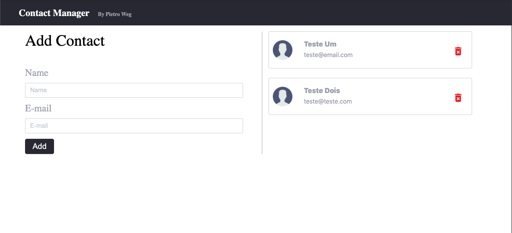

<h1 align="center">
   
</h1>

 

## 🧪 Tecnologias

Esse projeto foi desenvolvido com as seguintes tecnologias:

- [React](https://reactjs.org)
- [UUID](https://www.npmjs.com/package/uuid)

## 💻 Projeto

O contact-app é um projeto desenvolvido para praticar o uso de __React HOOKS__. A aplicação é um sistema simples para salvar contatos. O que foi usado:

- useState();
- useEffect();
- useReducer();
- Local Storage;
- Windows.localStorage;

## 🔖 Layout

O layout foi desenvolvido por mim, CSS puro, direcionado para o uso e prática da propriedade __position__.

---

